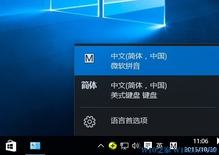
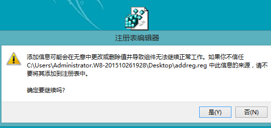
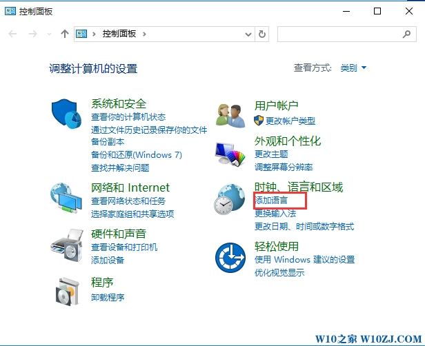
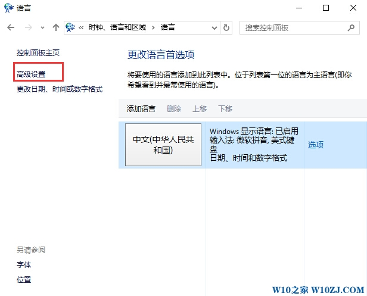
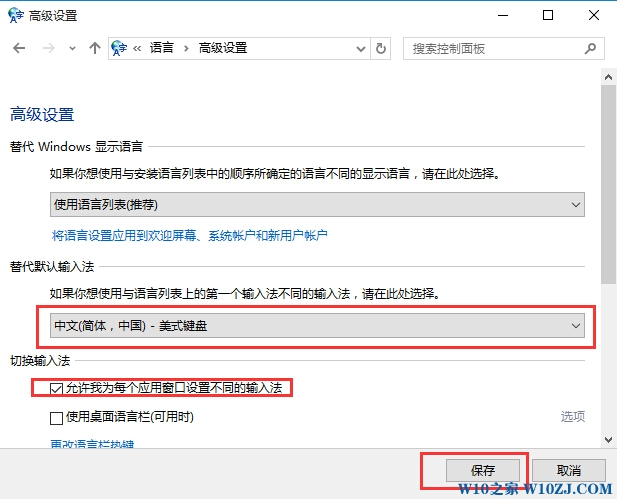

# Win10系统添加中文(简体,中国)美式键盘输入法的方法



操作步骤：

1、桌面上新建一个文体文档，然后打开复制下面代码：也可以下载准备好的：

```reg
Windows Registry Editor Version 5.00

[HKEY_CURRENT_USER\Keyboard Layout]
[HKEY_CURRENT_USER\Keyboard Layout\Preload]
"1"="00000804"
"2"="d0010804"
[HKEY_CURRENT_USER\Keyboard Layout\Substitutes]
"00000804"="00000409"
"d0010804"="00000804"
[HKEY_CURRENT_USER\Keyboard Layout\Toggle]
```

2、另存为reg文件，名字自定义吧，然后双击导入；



3、然后打开控制面板中打开“更换输入法”或添加语言；



4、然后点击“高级设置”选项；



5、然后将替代默认输入法设置为“中文（简体中文）-美式键盘”，并勾选“允许我为每个应用窗口设置不同的输入法”；



6、保存后，我们点开输入法切换，就可以看到简体中文-美式输入法了！可以通过按“Ctrl+Shift”或者“Win+空格”来切换到微软拼音。

---
via: <http://www.w10zj.com/Win10xy/Win10yh_142.html>
