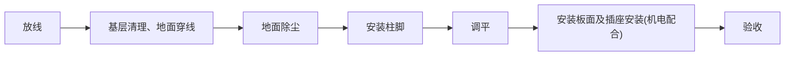
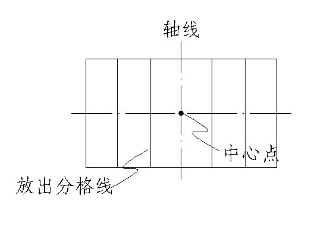
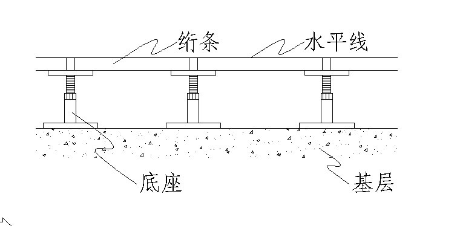
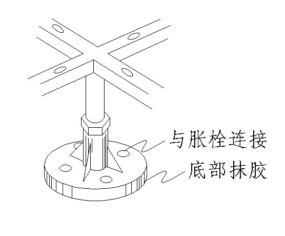

# 架空抗静电地板工程

## 一、材料要求

1. 活动地板的品种和规格由设计人确定，并在施工图中示明，采购时一定要按照设计要求购买配套系列的合格产品。
2. 活动地板面层承载力不应小于7.5MPa，系统电阻应为105~1010。板块面应平整、坚实，并具有耐磨、防潮阻燃、耐污染、耐老化和导静电等特点，技术性能应符合现行国家标准。
3. 环氧树脂胶、滑石粉、泡沫塑料条、木条、橡胶条、铝型材和角铁、铝型角铁等材质要符合要求。
4. 清理检查支架绗条的数量和质量。
5. 按要求码放于指定材料堆放场地，并立醒目标志以示他人；“架空地板堆放场”、“禁止非作业人员动用”。

## 二、主要机具

吸盘、切割锯、手刨、螺机、水平仪、水平尺、方尺、钢尺、小线、錾子、刷子、钢丝刷等。
## 三、作业条件

1. 材料检验已经完毕并符合要求。
2. 应已对所覆盖的隐蔽工程进行验收且合格，并进行隐蔽会签。
3. 施工前，应做好水平标志，以控制铺设的高度和厚度，可采用竖尺、拉线、弹线等方法。
4. 对所有作业人员已进行了技术交底，特殊工种必须持证上岗。
5. 作业时的施工条件应满足施工质量可达到标准的要求。
6. 基层地面或楼面平整、无明显凹凸不平。如平整度误差太大，就需要用水泥砂浆找平。

## 四、施工流程

### 1）工艺流程

### 2）主要施工技术措施

①放线：在需铺设地板的区域，按地板的排列图和轴线放出地面的分格线。

②基层修补：将分格线支叉位置即底脚安装处的缺陷修补完好如图二，再用吸尘器将表面浮物清吸干净。

③安装支承脚：在十字线交叉处将膨胀螺栓埋入。

④调平：按室内的水平高度调整地板标高，用水平仪再整体超平一次。支座与基层之间的空隙应灌注环氧树脂，应连接牢固。亦可按设计要求的方法固定。

⑤安装面板：根据房间的具体情况选择铺设方向。当无设备或流洞但模数不相符时，宜由外向里铺。当有设备或留洞时，应综合考虑选定铺设方向和顺序。先在横梁上铺设缓冲胶条，并用乳胶液与横梁粘合。保证四周接触平整、严密、不得采用加垫的方法。

⑥清理保护，铺设完成后，用吸尘器全面清理，对污染部位用稀料，酒精清洗干净，并涂擦地面蜡，完成后表面覆盖塑料布防护。立醒目标示“架空地板施工完毕注意保护”。

## 五、质量标准

### 1）一般项目

①地板面层应排列整齐、表面平整洁净，色泽一致，接缝均匀，周边顺直，标高准确。

### 2）地板面层的允许偏差

<table><tr><td colspan="2">项目</td><td>允许偏差(mm)</td><td>检查方法</td><td>检验数量</td></tr><tr><td>1</td><td>支架标高</td><td>±4</td><td>用水平仪</td><td rowspan="2">每间验4处横斜过道门口各一处</td></tr><tr><td>2</td><td>板面平整度</td><td>≤2</td><td>用2m靠尺和塞尺</td></tr><tr><td>3</td><td>板面拼缝平直</td><td>≤3</td><td>拉5m线不足5m拉通线和尺量</td><td rowspan="2">每间检查一处</td></tr><tr><td>4</td><td>板面缝隙宽度</td><td>≤0.2</td><td>塞尺检查</td></tr><tr><td>5</td><td>踢脚线上口平直</td><td>≤3</td><td>按第三项检查</td><td></td></tr></table>

## 六、成品保护

1）施工时应注意对定位定高的标准杆、尺、线的保护，不得触动、移位。

2）对所覆盖的隐蔽工程要有可靠的保护措施，不得因铺设地板面层造成漏水、堵塞、破坏或降低等级。

3）后续工程在地板面层上施工时，必须进行遮盖、支垫、严禁直接在地板上动火、焊接、和灰、调漆、支铁梯、搭脚手架等。

## 七、安全环保措施

1）在加工、施工过程中应注意避免扬尘、遗撒、沾带等现象，应采取遮盖、封闭、酒水、冲洗等必要措施。

2）运输、施工所用车辆、机械的废气、噪声等应符合环保要求。

3）电气装置应符合施工用电安全管理规定。

## 八、质量通病及预防

|序号|问题|原因|解决办法|
|---|---|---|---|
|1|接缝不平直，缝宽不一致|地板厚薄不匀，尺寸误差大；未预选，基层不平预排不准，排缝未拉线。|①严把进货关。 ②作业前预选，严格检查基层平整度，预排准确拼缝拉线。|
|2|开胶裂纹|材料保管不当运输损坏，有质量问题。|配专人保管材料质量问题退换。|
